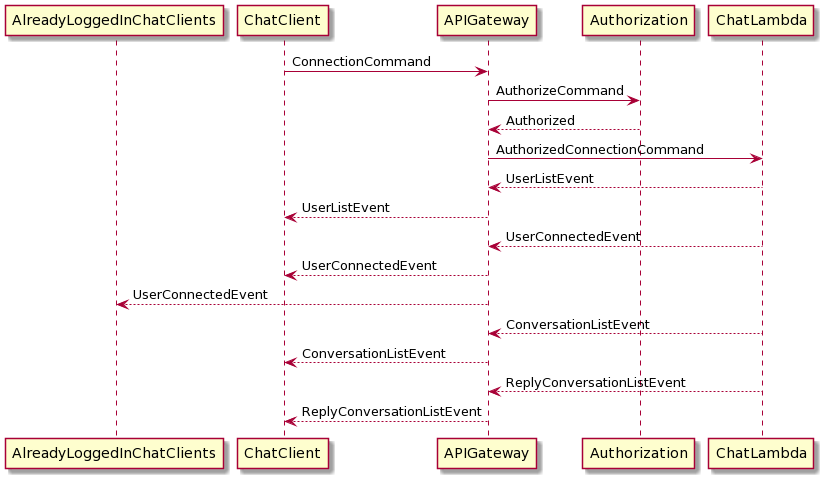
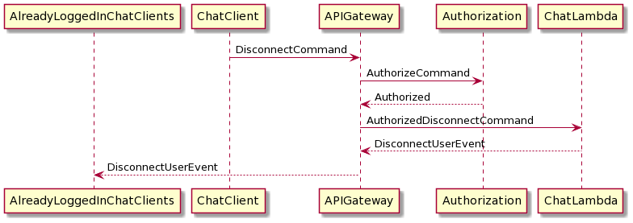
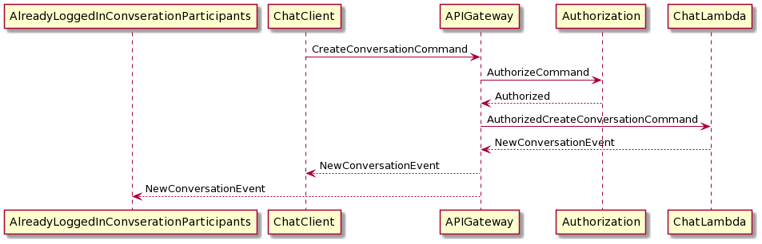
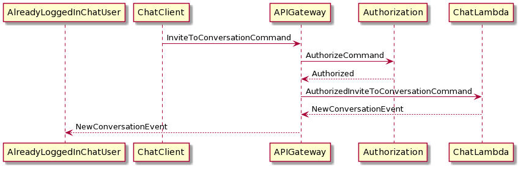
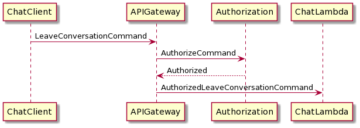
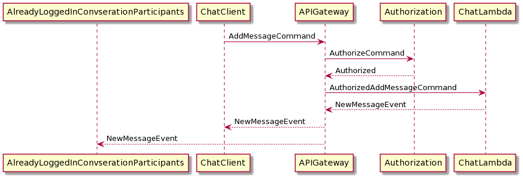
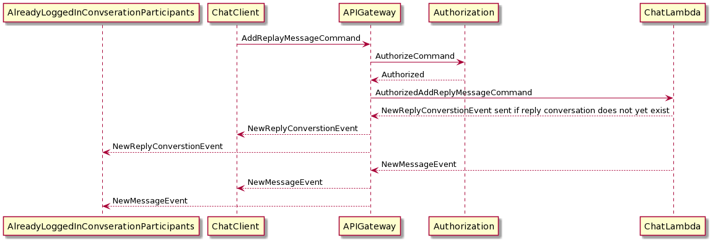
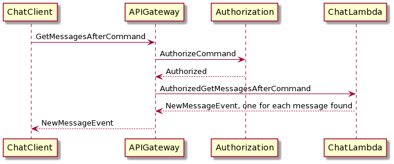

# Chat overview

Missing functionality:
- Get conversation participants (all conversations are global or DMs so information is not needed in V1)
- Get active users (although all users are sent in response to connect, so re-connect could be used in V1)
- Get messages prior to (not sure if it was requested in V1)

# Message sequences

## Connect

- Adds user to list of active users.
- Sends user a list of conversations in which the user can participate.
- Sends all active users (including the one just connected) a new user message.

## Disconnect

- Mark user as inactive
- Tears down the channel
- Sends all active users a message to indicate that the user has disconnected

## Create Conversation

Currently only supports the creation of a Direct Message conversation

- Create conversation
- Add participants to conversation 
- Sends all participants (including the one that created the conversation) a conversation created message

## Invite To Conversation

Not needed for current conversation types

- Add participants to conversation 
- Sends new participants (including the one that created the conversation) a conversation created message

## Leave Conversation

Not needed for current conversation types

- remove user from conversation participant list
- is user owns the conversation, removes the conversation

## Remove Conversation

Not needed for current conversation types

- is user owns the conversation, removes the conversation

## Add Message to Conversation

Used for all conversations except reply conversations

- add message to conversation message list
- Send a new message notification to all participants of the conversation (including the one that sent the message)

## Add Message to Reply Conversation (Reply to Message)

Not needed for current conversation types

- the conversation is automatically created, if it doesn't exist
- add message to conversation message list
- send a new message notification to all participants of the conversation (including the one that sent the message)

## Get Messages Since

- retrieve all messages in the conversation since the supplied time stamp
- send them to th user

## Get Conversation Participants

Not implemented - not need for current conversation types

## Get Prior Messages

Not implemented - will need soon

