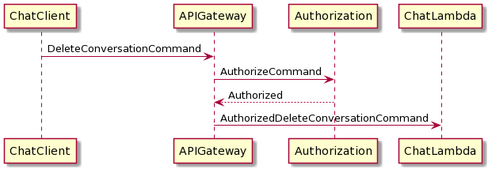

# Chat overview

# Message sequences

## Connect

Adds user to list of active users.
Sends user a list of conversations in which the user can participate.
Sends all active users (including the one just connected) a new user message.

## Disconnect

## Create Conversation

Currently only supports the creation of a Direct Message conversation

## Invite To Conversation

Not needed for current conversation types

## Leave Conversation

Not needed for current conversation types

## Remove Conversation

Not needed for current conversation types

## Add Message to Conversation

Used for all conversations except reply conversations

Send a new message notification to all participants of the conversation (including the one that sent the message)

## Add Message to Reply Conversation (Reply to Message)

Not needed for current conversation types

The conversation is automatically created, if it doesn't exist

Send a new message notification to all participants of the conversation (including the one that sent the message)

## Get Messages Since

## Get Conversation Participants

Not implemented - not need for current conversation types

## Get Prior Messages

Not implemented - will need soon

