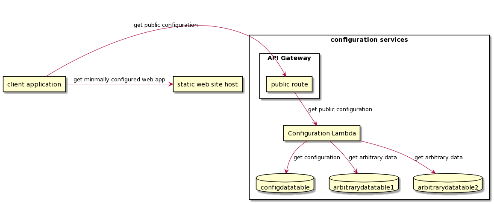
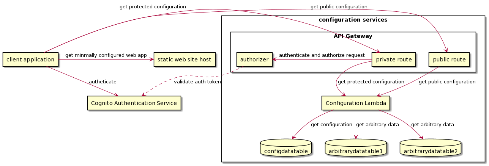

# Overview

There are currently two systems:
- A simple one page site with no authentication that serves the player (SimpleEventStage)
- A members only venue hall site with break out sesssion, a lobby, various rooms, and other features (StaticCognitoPOC)

The have roughly the same high level structure.

- A static site, hosted on AWS amplify which also provides CI/CD
- For sites that require authentication, a Cognito service (most likely one per event/organization)
- Lambda services to provide:
  - protected configuration information (e.g. player clip id) based on event/organization
  - customizable emails (currently hardcoded) based on event/organization
  - unprotected configuration information based on event/organization (stuff that we'd prefer to not be in the code)
- We use AWS SES for email notifications (not turned on yet); currently only used by Cognito
- AWS TLS certificate management
- AWS Route 53 for DNS

Each event currently has it's own subdomain, configured via Amplify

Information on the components with operations notes are in the sibling MD documents. The documents are organized by the primary component, e.g.
the Cognito component also contains some notes on SES, Route 53, and I think certificate management as required to complete Cognito administrative/Ops workflows.

Instructions on Amplify are currently in the site documentation (possibly only in the members only venue as the instructions for the simple site are a duplicate). They include instructions on how to set up custom domains with TLS support.

# Some helpful images

## Components of a simple event site

## Components of a simple event site with authenticated access

