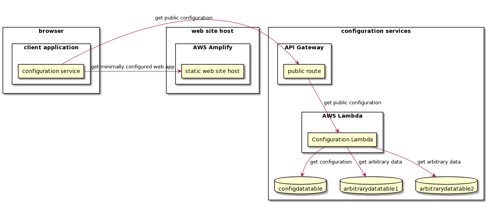
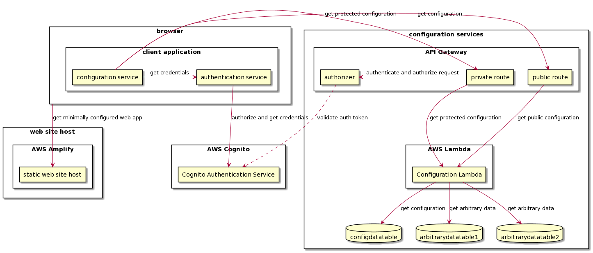
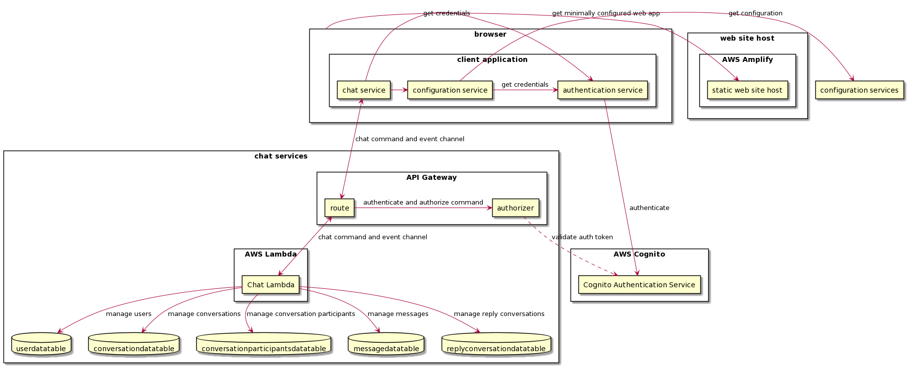

# Overview

There are currently two systems:
- A simple one page site with no authentication that serves the player (SimpleEventStage)
- A configurable venue hall site (virtualvenu) with optional authentication, a lobby, and zero of more of the following:
  - break out sesssion
  - various single function rooms (i.e. the "room" has a link to something, usually a video chat)
  - various multi function rooms
  - a video library
  - two rooms to display arbitrary data, usually used for attendee/speaker lists with links to external services
  - a chat room
  - a main stage with chat
  

The have roughly the same high level structure.

- A static site, hosted on AWS amplify which also provides CI/CD
- For sites that require authentication, a Cognito service (most likely one per event/organization)
- API Gateways that provide access the the configuration lambdas.
- Lambda services to provide:
  - protected configuration information (e.g. player clip id) based on event/organization
  - customizable emails (currently hardcoded) based on event/organization
  - unprotected configuration information based on event/organization (stuff that we'd prefer to not be in the code)
- We use AWS SES for email notifications; currently only used by Cognito
- AWS TLS certificate management
- AWS Route 53 for DNS

Each event currently has it's own subdomain, configured via Amplify.

There current setup is one API Gateway per event that points to a single lambda that is used for both protected and public configuration data for all events. We are investigating migrated to a setup that will have one configuration per event - using CloudFormation stacks. The goal is to use CloudFormation to make a simple and robust process for both creating and destroying the components used for events and to allow for code changes to be deployed with less need to worry about backwards compatibility; events are short lived, may require custom code, and run concurrently so, given that the operation costs of supporting custom instances are low it seems easier to take on the costs of running multiple systems in parallel than it is to try to support live backwards compatible updates.

Information on the components with operations notes are in the sibling MD documents. The documents are organized by the primary component, e.g.
the Cognito component also contains some notes on SES, Route 53, and I think certificate management as required to complete Cognito administrative/Ops workflows.

Instructions on Amplify are currently in the site documentation (possibly only in the members only venue as the instructions for the simple site are a duplicate). They include instructions on how to set up custom domains with TLS support.

# Some helpful images

## Components of a simple event site

## Components of a simple event site with authenticated access

## Components of an event site with authenticated access to the chat service

Configuration details removed

